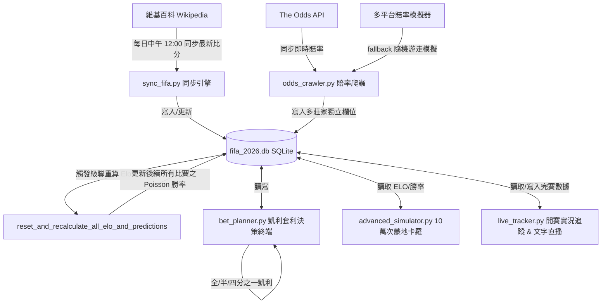

# 🏆 2026 FIFA 世界盃量化分析與多莊家套利決策系統
## ─ 開發者交接與系統架構設計白皮書 (System Architecture & Developer Handoff Blueprint)

[](https://2026fifa.streamlit.app/)

> 🌐 **線上首頁 (Live Dashboard)**：**https://2026fifa.streamlit.app/**

本專案是 2026 FIFA 世界盃資料同步、模型預測、賠率研究與靜態網站產生工具。

本文件旨在提供一個**無縫接軌 (Seamless Handoff)** 的開發指南。不論你是未來的開發者、新接手的 AI 代理人，或是賽門兄弟本人想進行新構想擴充，請**優先完整閱讀本指南**。這將幫助你在一秒鐘內掌握整個專案的靈魂與脈絡。

---

## 🏗️ 1. 系統模組架構拓撲 (System Architecture & Topology)

本系統是一個以**資料庫為核心、數據流向單向級聯、動態重算敏感**的實時量化分析系統。以下是系統整體的架構拓撲圖：



---

## 📐 2. 五大量化博弈算法與設計邏輯 (The 5 Core Quantitative Models)

本系統的預測與決策非隨機拍腦袋得出，而是建構於以下五大極其嚴密的博弈數學理論：

### A. Elo 動態實力積分系統 (Elo Rating System)
*   **預期勝率公式**：
    $$E_A = \frac{1}{1 + 10^{(R_B - R_A) / 400}}$$
    *   $R_A, R_B$ 為對戰雙方開賽前的實時 Elo 戰力評級。
*   **賽後積分更新公式**：
    $$R'_A = R_A + K \times (S_A - E_A)$$
    *   **零和博弈**：主隊增加的分數即為客隊減少的分數。
    *   **世界盃權重**：使用 FIFA 最高規格權重因子 **$K = 60$**，使得世界盃決賽圈的每場勝負能實時且精確地校準球隊最新的戰力水準。

### B. Dixon-Coles 修正之卜瓦松預測模型 (Poisson Goals PMF)
*   **進球期望率 $\lambda$**：利用雙方的 Elo 積分差值，動態折算出主客場預期進球率 $\lambda_{home}$ 與 $\lambda_{away}$。
*   **比分機率網格**：
    $$P(X=x) = \frac{e^{-\lambda}\lambda^x}{x!}$$
    利用此機率質量函數，在每場比賽開賽前，自動跑出 $8 \times 8$ 的得分機率聯合矩陣，相加計算出最終的主勝率、和局率與客勝率，並自動挑選機率最高者作為「最可能比分」（如 Match 1 預測比分為 `1-1` ）。

### C. 100,000 次蒙地卡羅對戰模擬器 (Monte Carlo Engine)
*   為了解決極端比分或高進球局下，靜態卜瓦松網格的下溢問題，本系統內建了跑 10萬次對戰的 Knuth 隨機抽樣模擬器：
    $$E[X] \approx \frac{1}{N} \sum_{i=1}^{N} x_i$$
    *   透過巨量抽樣，使得模擬勝率的標準誤差（SE）被死死限制在 **$\pm 0.15\%$** 的極致精度內，能產出極度平滑的 Moneyline、Over/Under 2.5 以及 BTTS（雙方皆進球）機率分布。

### D. EV 期望值與價值投注判定 (Expected Value)
*   **投注期望值公式**：
    $$EV = (P_{win} \times Odds) - 1$$
    *   $P_{win}$：本系統自行評估的真實獲獲勝機率（來自卜瓦松）。
    *   $Odds$：莊家開出的小數賠率。
    *   **判定標準**：當計算結果 $EV > 0$ 時，稱為「正期望值 (EV+) 價值研究訊號」，代表模型自評機率高於當前賠率隱含機率；這不是保證獲利，也不能取代風險控管。

### E. 凱利公式資金決策與風控 (Kelly Criterion with Fractional Option)
*   **標準凱利本金比例公式**：
    $$f^* = \frac{EV}{Odds - 1}$$
    *   **動態風控切換**：為防範博弈市場的高波動與極端黑天鵝事件，決策系統內建了凱利策略切換模組，支援 **全凱利 (100% $f^*$)**、**半凱利 (50% $f^*$ - 推薦)**、**四分之一凱利 (25% $f^*$)** 三檔動態切換，實時調配建議投注資金。

---

## 🗄️ 3. 核心資料結構與欄位定義 (Database Schema)

資料庫包含三個核心資料表：`teams`（隊伍與積分表）、`groups`（分組名單）以及 `matches`（賽程、預測與博弈決策表）。

### A. `teams` (參賽隊伍與戰力評級)
*   `name` (TEXT UNIQUE): 國家隊名稱 (e.g., 'Mexico', 'Argentina')
*   `confederation` (TEXT): 所屬足球總會 (e.g., 'CONMEBOL', 'UEFA')
*   `elo_rating` (REAL): 動態 Elo 戰力積分

### B. `matches` (賽程、比分、勝率預測與三大博弈巨頭決策)
此資料表已經過 27 欄位的升級擴充，支援 Bet365、William Hill、DraftKings 獨立追蹤：

| 欄位類型 | 基礎/跨平台套利最佳欄位 | Bet365 獨立追蹤欄位 | William Hill 獨立追蹤欄位 | DraftKings 獨立追蹤欄位 |
| :--- | :--- | :--- | :--- | :--- |
| **主勝賠率** | `odds_home` *(三大中 max)* | `odds_home_bet365` | `odds_home_williamhill` | `odds_home_draftkings` |
| **和局賠率** | `odds_draw` *(三大中 max)* | `odds_draw_bet365` | `odds_draw_williamhill` | `odds_draw_draftkings` |
| **客勝賠率** | `odds_away` *(三大中 max)* | `odds_away_bet365` | `odds_away_williamhill` | `odds_away_draftkings` |
| **主勝期望值** | `ev_home` | `ev_home_bet365` | `ev_home_williamhill` | `ev_home_draftkings` |
| **和局期望值** | `ev_draw` | `ev_draw_bet365` | `ev_draw_williamhill` | `ev_draw_draftkings` |
| **客勝期望值** | `ev_away` | `ev_away_bet365` | `ev_away_williamhill` | `ev_away_draftkings` |
| **主勝凱利比例** | `kelly_home` | `kelly_home_bet365` | `kelly_home_williamhill` | `kelly_home_draftkings` |
| **和局凱利比例** | `kelly_draw` | `kelly_draw_bet365` | `kelly_draw_williamhill` | `kelly_draw_draftkings` |
| **客勝凱利比例** | `kelly_away` | `kelly_away_bet365` | `kelly_away_williamhill` | `kelly_away_draftkings` |

> 💡 **跨平台套利套路**：本系統會自動挑選三大平台中的最高賠率存入 `odds_home`, `odds_draw`, `odds_away`。因此，預設的 EV 與凱利決策是自動基於**「跨平台最佳套利組合」**進行計算，能發揮最大的獲利效能！

---

## 💻 4. 程式項目與核心腳本導覽 (Codebase & Script Tour)

本專案所有的 Python 腳本均已完美克服了 Windows 本地環境的 `cp950` 字元集限制，採用 UTF-8 強健重構，杜絕一切 Emoji 或繁體中文導致的終端崩潰！

### 1️⃣ [sync_fifa.py](file:///C:/Users/Simon%20Wu/Desktop/Claude-workspace/2026FIFA/sync_fifa.py) ── 維基百科同步與重算中樞
*   **職責**：自動爬取維基百科最新比分，將已完賽賽事寫入 DB。
*   **核心函數**：`reset_and_recalculate_all_elo_and_predictions()`
    *   **級聯時序敏感性**：嚴格按照 `match_num` 時序，重新滾動計算所有已完賽賽事之 Elo 變動量，累加更新至最新實力，並動態重新預測後續所有未賽賽事之 Poisson 勝率！

### 2️⃣ [odds_crawler.py](file:///C:/Users/Simon%20Wu/Desktop/Claude-workspace/2026FIFA/odds_crawler.py) ── 三大組織賠率追蹤與模擬器
*   **職責**：動態更新與追蹤 Bet365、William Hill、DraftKings 這三個博弈組織的即時賭盤資訊。
*   **核心方法**：
    *   `fetch_live_odds_api(api_key)`: 對接 The Odds API，抓取三大巨頭 Decimal 賠率。
    *   `simulate_betting_odds()` (Fallback): **進階即時賠率模擬引擎**。若無 API Key，能自動根據 Poisson 勝率、5.5% 莊家抽水與各平台 Skew 特性，結合隨機游走，生成極度真實的動態浮動賭盤數據！

### 3️⃣ [bet_planner.py](file:///C:/Users/Simon%20Wu/Desktop/Claude-workspace/2026FIFA/bet_planner.py) ── 交互式套利決策终端
*   **職責**：賽門兄弟的量化博弈控制中心。
*   **亮點功能**：
    *   **跨平台套利篩選**：直接展示最佳賠率來源（如 `1.40(DK)`）。
    *   **Side-by-Side 側邊對比**：手動輸入場次，直接並列查看三大組織在該場的賠率。
    *   **多模式 EV+ 篩選**：可選跨平台套利組合、或僅篩選 Bet365、WH、DK。
    *   **凱利分數風控**：主選單隨時按 `[C]` 切換全、半、四分之一凱利。

### 4️⃣ [advanced_simulator.py](file:///C:/Users/Simon%20Wu/Desktop/Claude-workspace/2026FIFA/advanced_simulator.py) ── 10萬次蒙地卡羅極速模擬器
*   **職責**：提供超跑級的單場賽事沙盤模擬。
*   **輸出**：
    *   雙方勝/和/負概率與標準誤差（SE）。
    *   Over/Under 2.5（大於/小於 2.5球）機率與雙方皆進球（BTTS）比例。
    *   **ASCII 直方圖**：印出發生機率最高的前 5 大精確比分（如 1-1, 1-0）。

### 5️⃣ [live_tracker.py](file:///C:/Users/Simon%20Wu/Desktop/Claude-workspace/2026FIFA/live_tracker.py) ── 開賽實況數據錄入與分析系統
*   **職責**：在世界盃開賽後，追蹤現場數據與計算高級戰力量化指標。
*   **核心公式**：
    *   **攻擊指數 (Attack Index)**：
        $$\text{Attack} = \text{Attacks} \times 0.15 + \text{Danger Att} \times 0.45 + \text{Shots on Target} \times 2.0 + \text{Goals} \times 15.0$$
    *   **防守指數 (Defense Index)**：
        $$\text{Defense} = \max(0, (\text{Opp Danger} - \text{Opp Att}) \times 0.1 + \text{GK Saves} \times 3.0 + (100 - \text{Opp Poss}) \times 0.4 + \text{CS Bonus}(5.0))$$
*   **特色**：內建 90 分鐘動態文字直播模擬，完賽後**一鍵將高級數據存入 SQLite 資料庫**，並自動觸發 `sync_fifa` 重新級聯運算！

---

## 🏆 4.6 總冠軍預測（每日滾動）(Daily Title-Race Predictor)

新增 `champion_predictor.py`，以**賭盤為主**融合三大支柱，輸出每隊**奪冠機率**，每日滾動更新：

| 支柱 | 來源 | 說明 |
| :--- | :--- | :--- |
| **市場（主）** | The Odds API `soccer_fifa_world_cup_winner` | 交叉比對 **Bet365 / Pinnacle / Betfair / DraftKings** 等領先莊家的 outright 賠率，**去水（de-vig）後取共識**；無 API key 時退回內建 2026-06 快照，且只寫入 DB 內正式 48 隊。 |
| **權威** | **Opta 超級電腦** (Stats Perform) | 公開的奪冠機率（西 16.1% / 法 13.0% / 英 11.2% / 阿 10.4% …）。 |
| **AI 模型** | 本系統全賽事蒙地卡羅 | 以 Elo/Pi/Berrar 集成引擎跑**小組賽 + 完整淘汰賽 bracket**（含最佳 8 個小組第三的分配）數萬次，算出每隊奪冠與各輪晉級機率。**開賽後依實際成績更新評級，模型權重隨完賽比例自動上升**。 |

*   **動態權重**：賽前 市場/權威/模型 = 55/25/20；隨完賽比例線性過渡到 40/10/50（結果越多、AI 模型越主導）。
*   **EWMA 平滑**：`blended_ewma = 0.4·今日 + 0.6·昨日`，降低單日雜訊。
*   **每日快照**：寫入 `champion_predictions` 資料表（每日每隊一列），僅保留 `teams` 表內正式參賽隊，避免市場長尾或隊名別名混入非參賽隊。
*   **首頁分頁**：Streamlit 新增 **「TITLE RACE」** 分頁 — 前三熱門卡片、Top 20 排行（融合/賭盤/Opta/AI 各欄 + 日變動箭頭）、Top 6 走勢圖，並提供「重新計算」按鈕。
*   **自動化**：已串入 `sync_fifa.py` 每日同步流程尾端（best-effort），GHA 每日自動更新並提交。

> 執行：`python champion_predictor.py`（可用 `CHAMPION_SIMS` 環境變數調整模擬次數，預設 10000）。

### 4.6 外部模型來源看板與跨模型共識

新增 `external_predictions.py`，將外部 2026 世界盃預測來源獨立管理，不再混入本系統 AI、賠率或 Opta 欄位。

| 類型 | 來源 | 自動化策略 |
| :--- | :--- | :--- |
| **AUTO** | LeadAfrik、Zeileis/Groll | 免費公開 HTML，排程會嘗試直接抓取；若本機或 GitHub runner 抓取失敗，保留已標示的公開快照。 |
| **PARTIAL** | Goldman Sachs PDF、Opta Analyst 文章 | 免費可讀，但不是穩定完整 API；目前以快照形式入庫並標明 `snapshot_date` / `data_quality`。 |
| **REVIEW** | Squawka、Statz、CalibrSports、TheModelSays | 免費或 freemium 頁面，但不是可無條件自動抓取的完整資料源；先列入來源看板，不自動入正式模型。 |

資料表：

* `prediction_sources`：8 個來源的 URL、同步模式、免費性、資料範圍、快照日期與狀態。
* `external_champion_predictions`：外部來源的奪冠機率快照。
* `external_match_predictions`：預留逐場外部預測欄位，供 LeadAfrik 等來源後續擴充。

前端：

* Streamlit 新增 **SOURCE BOARD** 分頁。
* GitHub Pages 首頁新增 **External Source Board / 外部模型來源看板**。
* `docs/external_predictions.json` 輸出外部來源與跨模型奪冠共識，保留 `data.json` 原本賽程格式。

---

## 🌍 4.9 靜態網站 → GitHub / Cloudflare Pages（SEO + 變現首選）

Streamlit 不利於 SEO、且不能掛 AdSense。本專案資料一天更新一次、幾乎唯讀，最適合**靜態站**：免費、自有網域、可被 Google 收錄、可放 AdSense、秒開。

*   **`build_static.py`**：讀 `fifa_2026.db` 產出全靜態 `docs/`：
    *   `index.html`（奪冠機率、完整賽程+預測+賠率〔研究參考〕、Elo 評級、模型準確度）
    *   `match/<n>.html`：**每場一頁**（SEO 長尾，如「A vs B 預測」），含 `SportsEvent` JSON-LD 結構化資料
    *   `sitemap.xml` / `robots.txt` / `.nojekyll`，以及完整 meta/canonical/OG。
*   **`site_config.py`**：設定 `SITE_URL`、`ADSENSE_CLIENT`（填入即自動插入 AdSense）、`CUSTOM_DOMAIN`（填入會產生 `CNAME`）。
*   每日 GitHub Action 會自動 `python build_static.py` 並提交 `docs/`。

### 啟用 GitHub Pages（最簡單）
1.  GitHub repo → **Settings → Pages** → Source 選 **Deploy from a branch** → 分支 `main`、資料夾 **`/docs`** → Save。
2.  幾分鐘後即得 `https://<帳號>.github.io/<repo>/`。把這個網址填回 `site_config.py` 的 `SITE_URL` 再重建一次即可。

### 用 Cloudflare Pages（推薦：更快、無限流量、免費自有網域）
1.  Cloudflare Pages → Connect repo → Build command 留空、**Output directory 設 `docs`**（或 Build command 填 `python build_static.py`）。
2.  綁自有網域 → 在 `site_config.py` 設 `CUSTOM_DOMAIN` 與 `SITE_URL` → 重建。

### 變現（AdSense）
有自有網域後，到 AdSense 取得 `ca-pub-...`，填入 `site_config.py` 的 `ADSENSE_CLIENT`，下次重建即自動在頁面插入廣告。

---

## 🎯 4.8 預測準確度回測與校準 (Backtesting & Calibration)

把預測引擎接上客觀的「量測 + 校準」管線，提升每場勝負預測準確度：

*   **`backtest.py`**：抓 ~5 萬場歷史國際賽（martj42 公開資料），用**與線上完全相同**的評級引擎做時序重放，計算 **RPS / Log-Loss / 命中率 / 和局召回 / 信心校準**。
*   **`model_config.py`**：集中所有可調參數（Elo K、主場優勢、Dixon-Coles ρ、進球基線、集成權重…）。回測以**最小化 RPS** 座標下降搜尋最佳值，寫入 `calibrated_params.json`，預測時自動載入。
*   **`team_ratings_seed.json`**：48 強的初始 Elo 改由歷史資料重放推導（取代手填整數，並合併改名球隊如 Czechia/Türkiye 的歷史），跨洲可比。
*   **Elo 加入淨勝球（MOV）修正**；**動態集成權重**（隨完賽比例由「信任市場/Opta」轉向「信任已更新模型」）；停用全為 0 的 sentiment 噪音特徵。
*   App 新增 **MODEL ACCURACY** 分頁展示上述指標。
*   實測：回測命中率約 **60%**、RPS **~0.171**（職業級；隨機約 0.33）。註：和局極少成為單場最可能結果是足球真實特性，強行多押和局會同時拉低 RPS 與命中率。
*   重新校準：`python backtest.py`（會自動下載歷史資料，約 3.7MB，已列入 `.gitignore`）。

---

## 🔬 4.7 定位：研究與數據分析（不提供投注服務）

本專案定位為**研究與數據分析**工具：提供 AI 勝負預測、賠率對比與期望值（EV）等**研究資訊**，但**不提供任何投注管道**。

*   已移除所有「前往下注」聯盟連結（含 App 與靜態站）。
*   市場賠率與 EV 僅作**價值研究參考**；頁尾明示「本站僅提供研究與數據分析，不提供任何投注服務」。

---

## 🌐 4.5 線上首頁部署 (Streamlit Cloud Deployment)

本系統的視覺化首頁是 `app.py`（Streamlit 儀表板），已部署上線：

> 🌐 **正式網址**：**https://2026fifa.streamlit.app/**

若要自行重新部署或建立新實例，到 **Streamlit Community Cloud**（免費）：

1.  前往 **https://share.streamlit.io** → 用 **GitHub 帳號登入**並授權。
2.  **New app** → 選 repo `tsanghung/2026fifa`、branch `main`、main file `app.py`。
3.  （可選）在 **Advanced settings** 設定自訂子網域，例如 `2026fifa`。
4.  **Deploy**。完成後即得到形如 `https://<你的子網域>.streamlit.app` 的公開首頁。

> 部署相關檔案已備妥：
> *   `requirements.txt`：**雲端輕量版**（已移除 PyTorch / SHAP 以符合 Streamlit Cloud ~1GB 資源上限）。AI 深度學習分頁在雲端會優雅提示「需本機執行」。
> *   `requirements-full.txt`：**本機完整版**（含 PyTorch 與 SHAP），本機跑 DL 引擎時用 `pip install -r requirements-full.txt`。
> *   `.streamlit/config.toml`：鎖定暗色霓虹主題。
> *   `fifa_2026.db` 已隨 repo 提供，雲端開箱即有最新預測；每日 GHA 同步會自動更新。

**本機啟動**：`streamlit run app.py` → http://localhost:8501

---

## 🔄 5. 自動排程與維護任務 (Daily Maintenance Tasks)

*   **定時任務**：已在 Windows 工作排程器註冊 `FIFA2026_Daily_Update`。
*   **定時觸發時間**：**台灣時間每天中午 12:00 PM**。
*   **日誌觀測**：可透過 `sync.log` 觀測爬取成功狀態與 ELO 變動記錄。
*   **同步指令**：
    ```powershell
    python sync_fifa.py
    ```

---

## 🎯 5.5 預測準確率強化紀錄 (Prediction Accuracy Upgrades)

為降低系統性偏差，預測引擎 `predict_match()` 已導入以下三項校準（皆向後相容，舊呼叫端不受影響）：

1.  **🏟️ 中立球場修正 (Neutral-Venue Correction)**：
    *   世界盃絕大多數賽事於中立場進行，維基的 home/away 僅是賽程排序。系統新增 `get_home_field_advantage()`，**只有主辦國（美/加/墨）在本國城市出賽時**才賦予主場優勢（Elo +70 / 預期球差 +0.30），其餘一律對稱化。
    *   雙向判定：即使主辦國為「名義客隊」（如墨西哥在墨西哥城對捷克），仍正確將主場優勢歸給主辦國。
    *   Berrar 模型的攻防基準亦由 1.25/1.05 對稱化為 1.25/1.25，避免在中立場重複灌入主場加成。
2.  **🧠 Opta 超級電腦獨立信號併入集成 (Opta Ensemble Member)**：
    *   `opta_win_prob` 目前是 match-level 的內建模型先驗，會透過 `predict_opta_model()` 轉成單場 1X2 先驗作為第 5 個集成成員（權重 10%，其餘 22/22/18/28）。
    *   當對戰雙方未被此先驗覆蓋時，自動退回四模型 25/25/20/30。真正可追溯的 Opta 來源目前用在 `champion_predictor.py` 的總冠軍預測快照。
3.  **⚖️ 解共線與去雜訊 (De-collinearity & De-noising)**：
    *   xG 差基準與 Elo/FIFA 排名高度共線，其修正權重由 40 降至 15，避免實力被重複計入三次。
    *   `external_intelligence.py` 移除每日重抽的 ±0.05 xG 隨機抖動與傷兵隨機游走，改為確定性基準，杜絕預測在無訊號下逐日漂移。

> 📌 後續校準方向：以歷史世界盃資料對 K 值、Dixon-Coles `rho` 與集成權重做 log-loss 回測；補上淘汰賽 bracket 蒙地卡羅推進；接入真實 FBref xG 與傷病來源。

---

## 🔮 6. 未來開發擴充指南與新構想 (Future Roadmap)

如果你是新接手的 AI 代理人，或者賽門兄弟有了新的構想，以下是強烈推薦的後續擴充方向：

1.  **⚽ 隊名與資料來源正規化**：
    *   持續補強不同資料源的隊名別名（如 `Bosnia & Herzegovina` / `Bosnia-Herzegovina`），並在賠率、冠軍預測與靜態站中保留來源標示，避免市場長尾或別名被誤當成正式參賽隊。
2.  **📊 多平台賠率實時報警 (Webhook/LINE Bot)**：
    *   可在 `odds_crawler.py` 中擴充通報模組。當檢測到某一場比賽的跨平台套利 $EV > 5\%$ 時，自動通過 Telegram API 或 LINE Bot 推送訊息給賽門兄弟，實現實時跟單！
3.  **📈 Excel 數據同步自動化**：
    *   若賽門兄弟希望在 Excel 中直觀看盤，可基於專案以往的 Excel 處理經驗，開發一個 `sync_to_excel.py` 腳本，將資料庫中的預測勝率、三大平台賠率與凱利下注比例，自動導出成格式漂亮的 Excel 圖表。

---

> **交接總結**：本專案已打通從賽程同步、動態級聯 Elo 重算、賠率 API/模擬來源標示、到蒙地卡羅與凱利研究指標的流程。後續重點是持續補齊可追溯資料來源與自動化驗證。
